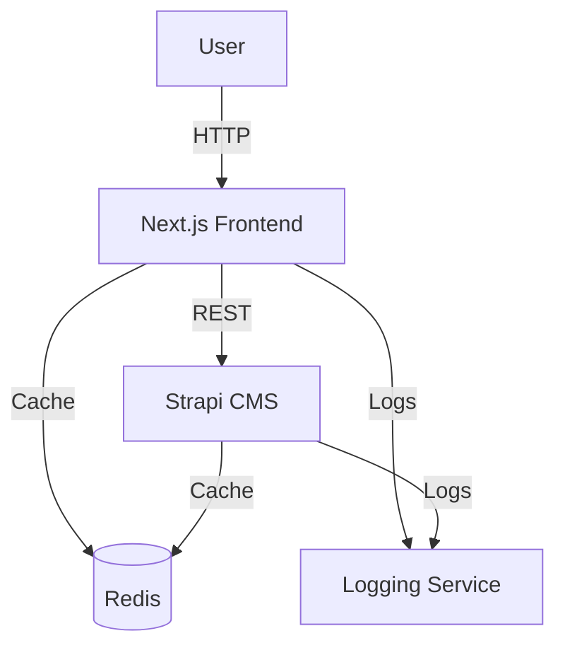
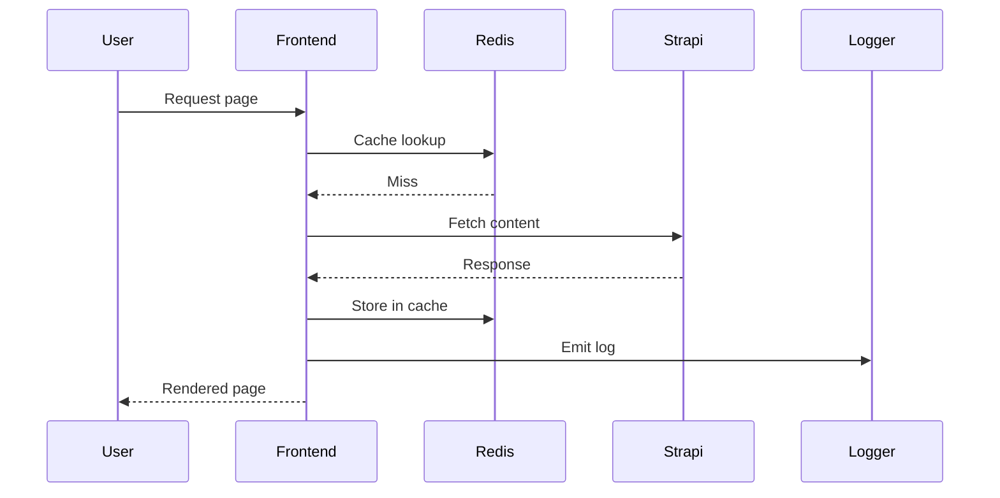

# Architekturübersicht

Diese Dokumentation bietet einen schnellen Überblick über die wichtigsten Bestandteile des Systems und deren Zusammenspiel.

## Systemübersicht

## Request Flow

---

*Zuletzt aktualisiert: 2025-08-05*

