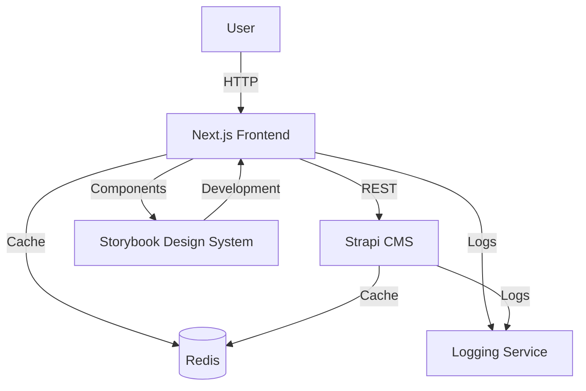
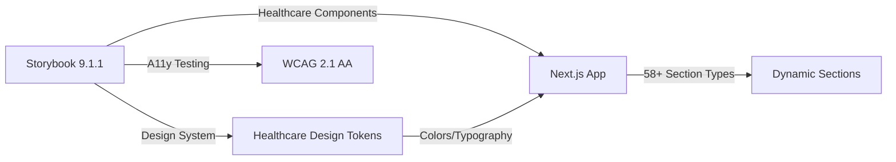
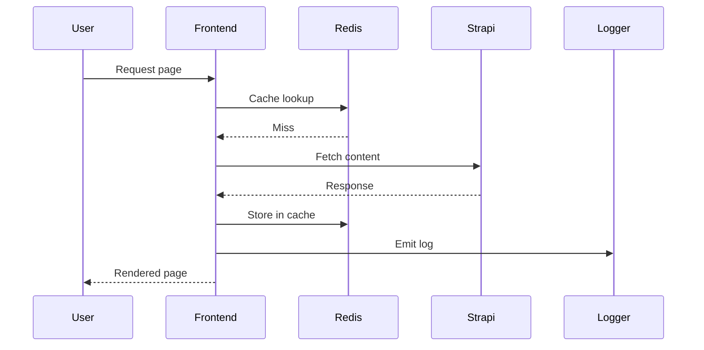
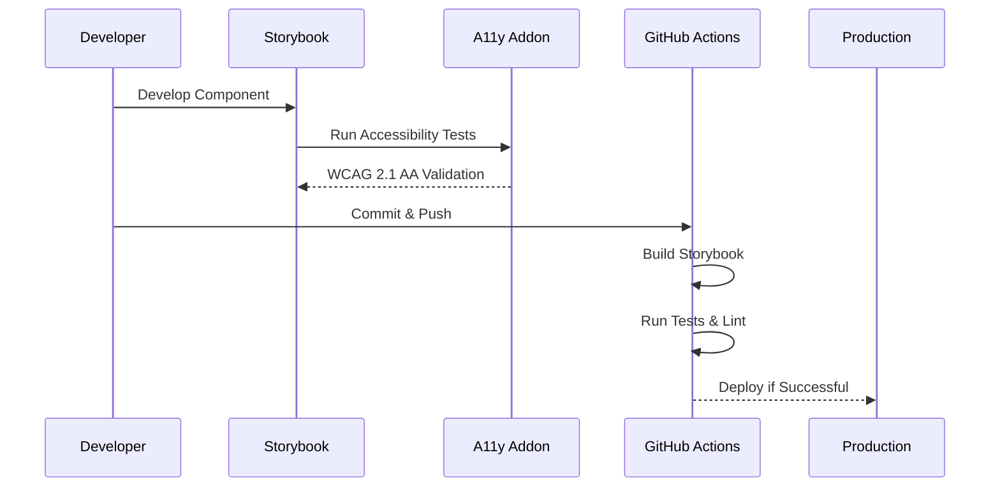

# Architekturübersicht

Diese Dokumentation bietet einen schnellen Überblick über die wichtigsten Bestandteile des Systems und deren Zusammenspiel.

## Systemübersicht

## Component Architecture

## Request Flow

## Development Architecture

### Frontend Stack
- **Next.js 15.4.6** - React framework with App Router
- **TypeScript 5.5.4** - Type safety and developer experience  
- **Tailwind CSS 3.4.10** - Utility-first styling with healthcare tokens
- **Storybook 9.1.1** - Component development and design system
- **Bun 1.1.26** - Fast package manager and runtime

### Component Development Flow

### Healthcare Design System
- **Color Palette**: Medical-grade trust colors (#004166, #1278B3, #B3AF09)
- **Typography**: Roboto Condensed for healthcare readability
- **Components**: WCAG 2.1 AA compliant with 56px+ touch targets
- **Accessibility**: Screen reader optimized, high contrast support

---

*Zuletzt aktualisiert: 2025-08-06 - Storybook Integration*

