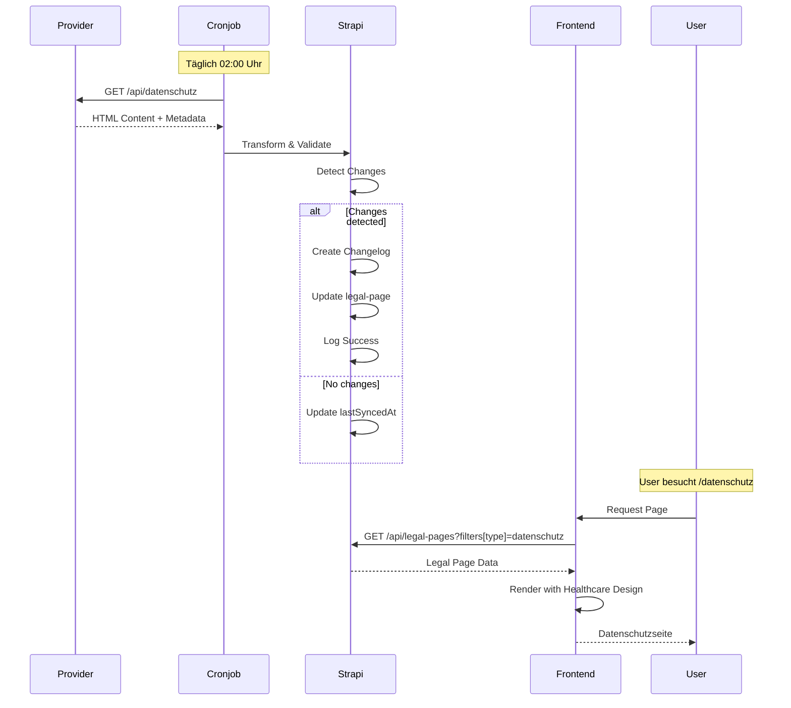

# Datenschutzerklärung - Option 4: Hybrid Lösung (Strapi + Auto-Sync)

## 🎯 Zielsetzung

Automatische Synchronisation der Datenschutzerklärung vom externen Beratungsunternehmen zu Strapi CMS, mit voller Frontend-Kontrolle und Healthcare-Design-Integration.

---

## 🏗️ Architektur-Übersicht

```
┌─────────────────────────────────┐
│  Datenschutz-Beratungsunternehmen│
│  (externe API/Webhook)          │
└────────────┬────────────────────┘
             │
             │ HTTP/Webhook
             ▼
┌─────────────────────────────────┐
│  Strapi CMS Backend             │
│  - Cronjob/Webhook Handler      │
│  - Content Transformation       │
│  - Version Control              │
│  - Changelog Tracking           │
└────────────┬────────────────────┘
             │
             │ REST API
             ▼
┌─────────────────────────────────┐
│  Next.js Frontend               │
│  - Server Component             │
│  - Healthcare Styling           │
│  - SEO Optimization             │
└─────────────────────────────────┘
```

---

## 📋 Implementierungs-Phasen

### **Phase 1: Strapi Backend (auf Strapi Server)**

#### 1.1 Content Type erweitern
- ✅ Bestehender `legal-pages` Content Type nutzen
- ➕ Zusätzliche Felder für Sync-Metadaten

**Neue Felder in `legal-pages`:**
```javascript
{
  // Bestehende Felder
  type: 'impressum' | 'datenschutz' | 'agb' | 'cookie-policy',
  content: 'text',
  version: 'string',

  // Neue Sync-Felder
  sourceProvider: 'string',          // Name des Beratungsunternehmens
  sourceUrl: 'string',               // Original-URL der Quelle
  lastSyncedAt: 'datetime',          // Zeitpunkt der letzten Synchronisation
  syncStatus: 'success' | 'failed',  // Status des letzten Syncs
  syncError: 'text',                 // Fehlermeldung bei Sync-Problemen
  autoSync: 'boolean',               // Automatische Synchronisation aktiviert
  syncFrequency: 'daily' | 'weekly', // Sync-Häufigkeit
  changelog: 'json',                 // Änderungshistorie
  providerVersion: 'string',         // Version vom Provider
  providerMetadata: 'json'           // Zusätzliche Provider-Metadaten
}
```

#### 1.2 Sync-Service implementieren
**Datei:** `src/api/legal-page/services/sync-service.js`

Funktionen:
- `syncFromProvider()` - Holt Daten vom Provider
- `transformContent()` - Konvertiert Provider-Format zu Strapi
- `detectChanges()` - Vergleicht neue vs. alte Version
- `createChangelog()` - Dokumentiert Änderungen
- `validateContent()` - Prüft HTML/Content auf Validität

#### 1.3 Webhook/API Endpoint
**Endpoint:** `POST /api/legal-pages/sync-datenschutz`

Ermöglicht:
- Manuellen Trigger per API
- Webhook vom Provider (bei Updates)
- Cronjob-Trigger

#### 1.4 Cronjob Setup
**Plugin:** `@strapi/plugin-cron` oder Custom Cronjob

Zeitplan:
- Täglich: 02:00 Uhr (Nacht-Zeit, wenig Traffic)
- Bei Fehler: Retry nach 1h, 6h, 24h

#### 1.5 Admin UI Erweiterung
- Dashboard-Widget: "Datenschutz Sync Status"
- Manueller Sync-Button
- Changelog-Ansicht
- Version-Vergleich (Diff-View)

---

### **Phase 2: Frontend Integration (Next.js)**

#### 2.1 API Integration
**Datei:** `src/lib/strapi/legal-pages.ts`

Bereits vorhanden, keine Änderung nötig! ✅

```typescript
// Verwendet bestehende getLegalPage() Funktion
const datenschutz = await getLegalPage('datenschutz')
```

#### 2.2 Page Implementation
**Datei:** `src/app/datenschutz/page.tsx`

Identisch zum Impressum-Pattern:
- Server Component
- Strapi API Call
- Healthcare Design
- Emergency Banner
- SEO Metadata

#### 2.3 Styling
**Datei:** `src/styles/globals.css`

Healthcare-spezifisches Styling für Legal Content:
- Typografie-Hierarchie
- Link-Styling
- Tabellen-Layout
- Responsive Design

---

### **Phase 3: Monitoring & Maintenance**

#### 3.1 Logging
- Sync-Erfolg/Fehler protokollieren
- Änderungen tracken
- Performance-Metriken

#### 3.2 Alerts
- Email bei Sync-Fehler
- Webhook an Monitoring-System
- Slack/Discord Notification (optional)

#### 3.3 Backup
- Vorherige Versionen behalten
- Rollback-Funktion
- Export-Funktionalität

---

## 📊 Vorteile von Option 4

| Aspekt | Vorteil |
|--------|---------|
| **SEO** | ✅ Vollständig indexierbar durch Server-Side Rendering |
| **Performance** | ✅ Gecacht in Strapi + Next.js, sehr schnell |
| **DSGVO** | ✅ Keine Third-Party Scripts im Browser |
| **Accessibility** | ✅ Nativer HTML, WCAG 2.1 AA konform |
| **Design** | ✅ Volle Kontrolle über Healthcare-Design |
| **Updates** | ✅ Automatisch vom Provider synchronisiert |
| **Versionierung** | ✅ Changelog und Rollback-Funktion |
| **Offline-Fähigkeit** | ✅ Strapi als Fallback bei Provider-Ausfall |
| **Editor-Zugriff** | ✅ Anpassungen in Strapi möglich |
| **Compliance** | ✅ Audit-Trail durch Changelog |

---

## 🔄 Sync-Workflow



---

## 🛠️ Technische Anforderungen

### Strapi Server
- Node.js 18+ (bereits vorhanden)
- Strapi 5.20.0+ (bereits vorhanden)
- Axios oder node-fetch (für HTTP Requests)
- node-cron oder @strapi/plugin-cron
- Cheerio oder JSDOM (für HTML Parsing)
- DOMPurify (für HTML Sanitization)

### Frontend
- Next.js 15.4.6 (bereits vorhanden)
- Bestehende Strapi Integration (bereits vorhanden)
- Keine zusätzlichen Dependencies nötig ✅

### Provider-Integration
**Anforderungen an das Beratungsunternehmen:**
- API Endpoint für Datenschutzerklärung
- Oder: Webhook-Support bei Content-Updates
- Authentifizierung (API Key, OAuth, etc.)
- Response-Format: HTML oder Markdown
- Optional: Versionsnummer in Response

**Beispiel API-Response:**
```json
{
  "version": "2024.11.20",
  "lastModified": "2024-11-20T10:00:00Z",
  "content": "<h1>Datenschutzerklärung</h1>...",
  "language": "de",
  "metadata": {
    "wordCount": 5420,
    "sections": ["Einleitung", "Verantwortlicher", "..."]
  }
}
```

---

## 📅 Implementierungs-Zeitplan

| Phase | Aufgaben | Zeitaufwand | Verantwortlich |
|-------|----------|-------------|----------------|
| **Phase 1.1-1.2** | Strapi Content Type + Sync Service | 4-6h | Strapi Developer |
| **Phase 1.3-1.4** | Webhook/API + Cronjob | 2-3h | Strapi Developer |
| **Phase 1.5** | Admin UI | 2-3h | Strapi Developer |
| **Phase 2.1-2.2** | Frontend Integration | 2-3h | Frontend Developer |
| **Phase 2.3** | Healthcare Styling | 1-2h | Frontend Developer |
| **Phase 3** | Monitoring & Testing | 2-3h | DevOps/Both |
| **Gesamt** | | **13-20h** | |

---

## 🔐 Sicherheits-Überlegungen

1. **API Authentication**
   - Sichere Speicherung von API Keys in Strapi ENV
   - Rate Limiting für Sync-Endpoint
   - IP Whitelisting (optional)

2. **Content Validation**
   - HTML Sanitization (XSS Prevention)
   - Content-Length Limits
   - Malware Scanning (optional)

3. **Access Control**
   - Nur Admin-Rolle kann Sync triggern
   - Audit-Log für manuelle Änderungen
   - Versionskontrolle für Rollbacks

4. **DSGVO Compliance**
   - Keine personenbezogenen Daten im Provider-Request
   - Logging ohne sensible Informationen
   - Verschlüsselte API-Kommunikation (HTTPS)

---

## 📈 Monitoring & KPIs

### Metriken
- **Sync Success Rate:** Ziel >99%
- **Sync Duration:** Ziel <30s
- **Content Freshness:** Max. 24h alt
- **Change Frequency:** Durchschnittliche Updates/Monat
- **Frontend Performance:** LCP <2.5s

### Alerts
- ⚠️ Sync-Fehler nach 3 Retries
- ⚠️ Provider Response Time >10s
- ⚠️ Content Validation Failed
- ⚠️ Keine Updates seit >30 Tagen (ungewöhnlich)

---

## 🚀 Go-Live Checklist

- [ ] Provider API Credentials konfiguriert
- [ ] Strapi Content Type erweitert
- [ ] Sync Service implementiert und getestet
- [ ] Cronjob konfiguriert
- [ ] Admin UI funktioniert
- [ ] Frontend Page implementiert
- [ ] Healthcare Styling angewendet
- [ ] Manueller Test: Sync triggern
- [ ] Automatischer Test: Cronjob läuft
- [ ] Monitoring & Alerts konfiguriert
- [ ] Dokumentation aktualisiert
- [ ] Team-Training durchgeführt

---

## 📚 Nächste Schritte

1. **Strapi-Server:** Siehe `STRAPI-SYNC-PROMPT.md` für detaillierte Implementierungs-Anweisungen
2. **Provider-Integration:** API-Dokumentation vom Beratungsunternehmen anfordern
3. **Frontend:** Datenschutz-Seite mit bestehendem Pattern erstellen
4. **Testing:** End-to-End Test des gesamten Workflows

---

**Erstellt:** 20.11.2025
**Version:** 1.0
**Status:** Planung abgeschlossen, Ready for Implementation
